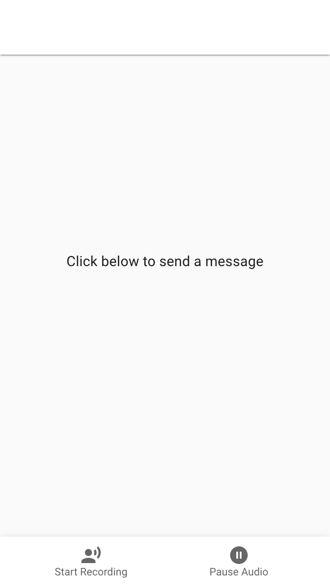

# interview-beon-radpair

Interview BeOn Radpair Voice App

# Getting Started


<details>
<summary>Click here to see the System Design as event-oriented architecture </summary>


</details>

## Project Structure

The project is structured in two applications: a web app built in React.js using
craco boiler plate; and an api built with FastApi. Here's how it looks:

```
apps/
├─ api/ (1)
│  ├─ src/
│  │  ├─ controller/
│  │  ├─ service/
│  │  ├─ main.py
│  │  ├─ router.py
│  ├─ tests/
│  │  ├─ .../
│  ├─ .env
│  ├─ app.py
├─ web/ (2)
│  ├─ src/
│  │  ├─ components/
│  │  ├─ contexts/
│  │  ├─ hooks/
│  │  ├─ App.tsx
│  │  ├─ index.tsx
│  ├─ package.json
docs/ (3)
├─ videos/
│  ├─ Flight Test 1
│  ├─ Flight Test 2
README.md
```

Where:

1. `api/`: api that will receive an audio and connect with LLM for an answer.
2. `web/`: web app with the interface to talk to the api.
3. `docs/`: documentation and Flight tests recorded during development.

## Setup

```
$ cd apps/api && poetry run python app.py &
$ cd ../web && npm run dev &
```

## Starting server

```
$ cd apps/api
$ poetry run python app.py

INFO:     Started server process [76431]
INFO:     Waiting for application startup.
INFO:     Application startup complete.
INFO:     Uvicorn running on http://127.0.0.1:8020 (Press CTRL+C to quit)
```

## Starting app



Starting:

```
$ cd apps/web
$ npm run dev

Compiled successfully!

You can now view web in the browser.

  Local:            http://localhost:3000
  On Your Network:  http://192.168.0.13:3000

Note that the development build is not optimized.
To create a production build, use npm run build.

webpack compiled successfully
No issues found.
```

## Video demo

- [./docs/videos/Flight Test 2.mov](https://github.com/matheus-santos/interview-beon-radpair/wiki)

# Next Steps

This PoC is quite raw and we have a lot of room for improvement. Here's how
the next steps would look like:

Front-End:

- Separate audio recorder capabilities into a Utility folder.
- Add unit tests using RTL and jest.
- Add interface tests using Cypress.
- Compress audio into gzip for faster transfer to the API.

Back-End:

- Add unit and integration tests on the Back-End side for controller and services.
- Add mocks into LLM Service to mitigate API costs.
- Compress response into a gzip for faster transfer to the API.

Infrastructure:

- Create a Docker file and virtual environment for the Api.
- Add build capabilities for Front-End app to generate a production-ready zip.
